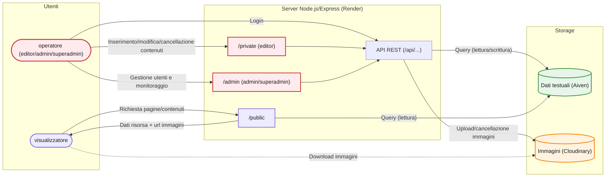

# Archivio musicale Luca Moretti

Applicazione web full-stack per la digitalizzazione e la consultazione pubblica dell'Archivio musicale Luca Moretti: edizioni, manoscritti, stampe, fotografie ed eventi correlati, con un'area riservata per la gestione dei contenuti da parte di utenti autorizzati.

## Indice

- [Panoramica](#panoramica)
- [Stack tecnologico](#stack-tecnologico)
- [Architettura](#architettura)
- [Struttura del progetto](#struttura-del-progetto)
- [Ruoli e permessi](#ruoli-e-permessi)
- [Funzionalità](#funzionalità)
- [API](#api)
- [Sicurezza](#sicurezza)
- [Licenza](#licenza)

## Panoramica

Il sito espone al pubblico il catalogo dell'archivio (edizioni/manoscritti, stampe, eventi), e offre un'area riservata dove operatori autorizzati (editor, admin, superadmin) possono inserire, modificare e cancellare i contenuti, gestire gli utenti e monitorare le modifiche apportate all'archivio.

Il server applicativo è ospitato su **Render** (Francoforte, UE); i dati testuali sono conservati in un database MySQL ospitato su **Aiven** (Amsterdam, UE), mentre le immagini sono gestite tramite **Cloudinary**.

## Stack tecnologico

**Backend**
- Node.js + Express 5
- MySQL (driver `mysql2`, connessione via pool) — hosting su Aiven
- JWT (`jsonwebtoken`) per l'autenticazione via cookie `httpOnly`
- `bcryptjs` per l'hashing delle password
- `multer` (in memoria) + Cloudinary SDK per l'upload delle immagini
- `express-rate-limit` per la protezione da brute-force sul login

**Frontend**
- HTML, CSS, JavaScript vanilla
- Costruzione dinamica del DOM lato client tramite fetch verso le API

**Hosting**
- Applicazione Node.js in produzione su **Render**

## Architettura



## Struttura del progetto

```
├── index.js                     # entry point del server Express
├── database/
│   ├── schema.sql                # definizione delle tabelle
│   └── seed.sql                  # utente superadmin iniziale
├── src/
│   ├── db.js                     # pool di connessione MySQL (Aiven, con SSL)
│   ├── cloudinaryConfig.js        # config Cloudinary + multer (validazione upload)
│   ├── middleware/
│   │   ├── auth.js               # autenticazione JWT, autorizzazione per ruolo, rate limiter login
│   │   └── images.js             # gestione errori di upload (multer)
│   ├── routes/
│   │   ├── authRoutes.js          # login, logout, sessione (/api/me)
│   │   ├── utentiRoutes.js        # CRUD utenti, cambio password
│   │   ├── edizioniRoutes.js      # CRUD edizioni/manoscritti
│   │   ├── stampeRoutes.js        # CRUD stampe/fotografie
│   │   ├── eventiRoutes.js        # CRUD eventi
│   │   └── statisticheRoutes.js   # conteggi, monitoraggio contenuti, sitemap
│   └── utils/
│       ├── validazione.js         # validazione stringhe/URL/URL social riutilizzabile
│       ├── hash.js                # hashing password riutilizzabile
│       └── dbKeepAlive.js         # ping periodico al DB per evitare timeout
├── public/                       # sito pubblico (catalogo, schede, login)
├── private/                      # area riservata editor
└── admin/                        # area riservata admin/superadmin
```

## Ruoli e permessi

| Ruolo | Consultazione pubblica | Inserimento/modifica contenuti | Gestione utenti |
|---|---|---|---|
| Visitatore (non autenticato) | ✅ | ❌ | ❌ |
| `editor` | ✅ | ✅ | ❌ |
| `admin` | ✅ | ✅ | ✅ (solo `editor`) |
| `superadmin` | ✅ | ✅ | ✅ (`admin` ed `editor`) |

L'autenticazione avviene tramite JWT firmato, salvato in un cookie `httpOnly`; il ruolo è incluso nel payload e verificato ad ogni richiesta protetta.

## Funzionalità

- Catalogo pubblico di edizioni/manoscritti e stampe, con ricerca per autore/titolo
- Schede di dettaglio con galleria immagini (slider per contenuti con più immagini)
- Sezione eventi, con link opzionali al sito ufficiale, Facebook e Instagram (validati lato server)
- Area riservata per operatori: inserimento, modifica e cancellazione di edizioni, stampe ed eventi, con upload multiplo di immagini su Cloudinary
- Area amministrativa: creazione/cancellazione utenti, monitoraggio di chi ha creato/modificato ciascun contenuto, correzione massiva automatica di descrizioni/note (punteggiatura mancante)
- Generazione dinamica di `sitemap.xml` per la SEO
- Redirect automatico post-login in base al ruolo dell'utente

## API

Tutti gli endpoint restituiscono JSON nella forma `{ success, message, ... }`, salvo la sitemap (XML).

**Autenticazione** (`authRoutes.js`)
| Metodo | Endpoint | Accesso |
|---|---|---|
| GET | `/accedi` | pubblico (redirige se già autenticato) |
| POST | `/api/login` | pubblico (rate-limited) |
| POST | `/api/logout` | pubblico |
| GET | `/api/me` | autenticato |

**Utenti** (`utentiRoutes.js`)
| Metodo | Endpoint | Accesso |
|---|---|---|
| POST | `/api/utente` | admin, superadmin |
| GET | `/api/utenti` | admin, superadmin |
| DELETE | `/api/utente/:id` | admin, superadmin |
| PATCH | `/api/utente/password` | autenticato (utente stesso) |

**Edizioni / Stampe / Eventi** (schema identico per le tre risorse)
| Metodo | Endpoint | Accesso |
|---|---|---|
| GET | `/api/edizioni`, `/api/stampe`, `/api/eventi` | pubblico (dettagli extra se autenticato) |
| GET | `/api/edizione/:collocazione`, `/api/stampa/:collocazione`, `/api/evento/:codice` | pubblico (dettagli extra se autenticato) |
| POST | `/api/edizione`, `/api/stampa`, `/api/evento` | editor, admin, superadmin |
| PUT | `/api/edizione/:collocazione`, `/api/stampa/:collocazione`, `/api/evento/:codice` | editor, admin, superadmin |
| DELETE | `/api/edizione/:collocazione`, `/api/stampa/:collocazione`, `/api/evento/:codice` | editor, admin, superadmin |
| PATCH | `/api/edizioni` | admin, superadmin (correzione massiva) |

**Statistiche e utilità** (`statisticheRoutes.js`)
| Metodo | Endpoint | Accesso |
|---|---|---|
| GET | `/api/conta-reperti` | pubblico |
| GET | `/api/monitor-contenuti` | admin, superadmin |
| GET | `/sitemap.xml` | pubblico |
| GET | `/health` | pubblico (usato per keepalive Render)

## Sicurezza

Il progetto adotta le seguenti misure, introdotte e verificate iterativamente durante lo sviluppo:

- **Query parametrizzate** ovunque: nessuna concatenazione di stringhe SQL, protezione da SQL injection;
- **Escaping HTML lato client** (`escapeHTML`) su tutti i dati generati dall'utente prima dell'inserimento via `innerHTML`, per prevenire XSS stored;
- **Validazione URL** (`validaUrl`/`validaUrlSocial`) su tutti i link facoltativi, con controllo esplicito del protocollo (`http`/`https`) e, per i social, del dominio effettivo;
- **Password**: hashing con `bcrypt` (mai salvate in chiaro); requisiti minimi di robustezza (lunghezza, varietà di caratteri, assenza di dati personali riconoscibili) applicati al cambio password, obbligatorio al primo accesso;
- **Blocco account**: dopo 3 tentativi di login falliti l'account viene bloccato temporaneamente, con backoff esponenziale sui blocchi consecutivi (15 min, 1h, 4h... fino a un tetto di 24h), a mitigazione di attacchi di forza bruta mirati a un singolo utente;
- **Mitigazione dei side-channel temporali sul login**: anche quando l'email non risulta registrata viene comunque eseguito un confronto bcrypt "fantasma", per non lasciare trapelare dai tempi di risposta quali indirizzi email sono effettivamente censiti nel sistema;
- **Sessioni**: JWT in cookie `httpOnly`, `sameSite: Lax`, `secure` in produzione, scadenza a 1 ora, invalidazione forzata (nuovo login richiesto) dopo il cambio password;
- **Rate limiting** sul login (10 tentativi/15 min per IP, i tentativi riusciti non vengono conteggiati), con `trust proxy` configurato per leggere correttamente l'IP reale dietro un eventuale reverse proxy;
- **Upload immagini**: whitelist di tipi MIME, limite di dimensione (5MB) e di numero di file, gestione centralizzata degli errori di upload;
- **Autorizzazione granulare per ruolo** su ogni endpoint sensibile, con una variante "morbida" per esporre/nascondere campi (es. collocazione) in base al ruolo di chi consulta;
- **Header anti-cache** sulle risposte autenticate, per evitare che pagine riservate restino accessibili dalla cache del browser dopo il logout;

- **Content Security Policy** (via Helmet), che limita script, stili e immagini alle sole origini attese, come ulteriore barriera in caso di XSS;

## Licenza

Codice pubblicato solo a scopo dimostrativo/portfolio. Tutti i diritti riservati — vedi [LICENSE](./LICENSE).